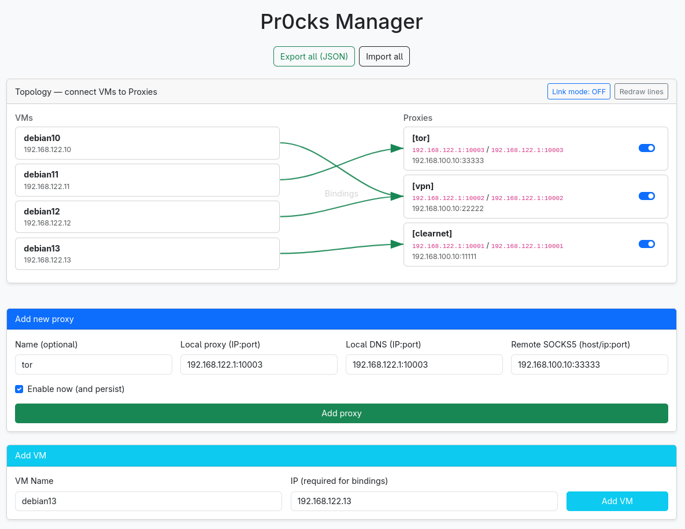
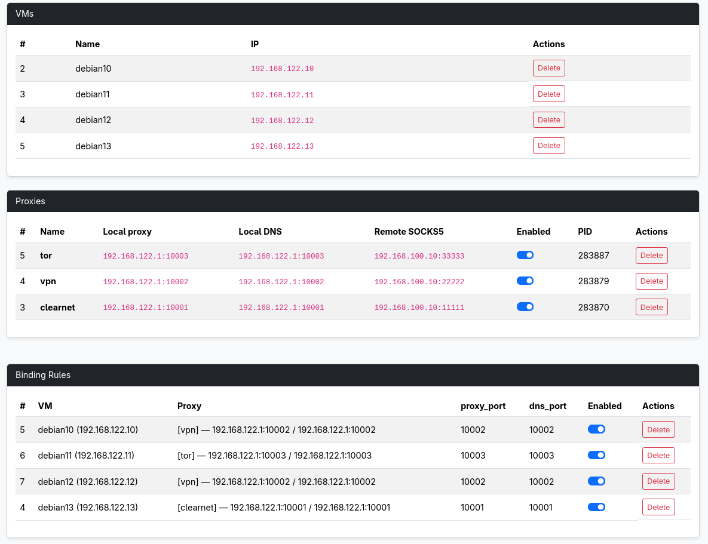

# Pr0cks Manager

## Introduction
This app manages local [pr0cks](https://github.com/n1nj4sec/pr0cks) instances (proxy+DNS) and per-VM bindings that install strict iptables so traffic is forced through a SOCKS5 proxy VM, with host guard rails enabled by default.





## Example topology
```java
[ Isolated ]  virbr1 192.168.122.0/24
   └─ Client VM (e.g. 192.168.122.10)
                |
             REDIRECT
                |
                V
Host runs pr0cks on isolated GW (e.g. 192.168.122.1:10001)
                |
              TPROXY
                |
                V
[ NAT ]       virbr0 192.168.100.0/24
   └─ Proxy VM (e.g. 192.168.100.10:12345 SOCKS5)
```

A binding (VM → Proxy) creates tagged rules (--comment "pr0cks_vm:<id>") and pr0cks redirects everything to the proxy vm.

## Quick start
### Create Proxy VM
Install [ShadowProxy](https://github.com/guyingbo/shadowproxy):
```bash
pip3 install shadowproxy --break-package-system

# ...install your vpn client, TOR or just leave the clearnet traffic
```

Add the systemd service `/etc/systemd/system/shadowproxy@.service`:
```bash
[Unit]
Description=Shadowproxy (SOCKS5) on port %i
Wants=network-online.target
After=network-online.target

[Service]
Type=simple
ExecStart=/usr/local/bin/shadowproxy socks://0.0.0.0:%i
Restart=always
RestartSec=5

# Hardening
NoNewPrivileges=true
PrivateTmp=true
PrivateDevices=true
ProtectSystem=strict
ProtectHome=true
ProtectKernelTunables=true
ProtectKernelModules=true
ProtectControlGroups=true
LockPersonality=true
MemoryDenyWriteExecute=true
RestrictRealtime=true
RestrictAddressFamilies=AF_INET AF_INET6 AF_UNIX
RestrictNamespaces=true
SystemCallFilter=~@mount @debug @audit @raw-io

[Install]
WantedBy=multi-user.target
```

Enable and execute the service:
```bash
systemctl daemon-reload
systemctl enable --now shadowproxy@12345
```

### Run docker
```bash
docker compose up -d --build
# open http://127.0.0.1:8000 in your browser
```

### UI
Add a proxy:
- local proxy: `192.168.122.1:10001`
- local DNS: `192.168.122.1:10001`
- remote SOCKS5: `192.168.100.10:12345`
- enable to start pr0cks.

Add VM (name, IP on isolated net).

Create Binding (VM → Proxy):
1. clink on the "Link mode: OFF" toggle
2. click on the desired VM
3. click on the desired Proxy name
4. boom, you now navigate through the proxy

## Networking
Given:
- VM: `192.168.122.10`
- pr0cks listen: `192.168.122.1:10001` (both proxy & DNS)
- Bridges: `$ISO_BR=virbr1`, `$NAT_BR=virbr0` (examples)
- Proxy VM (SOCKS5): `192.168.100.10:12345`
- Tag: `pr0cks_vm:<id>`

The traffic will be forced into pr0cks
```bash
# DNS to pr0cks
-A PREROUTING -s 192.168.122.10/32 -p tcp --dport 53   -m comment --comment "pr0cks_vm:<id>" -j REDIRECT --to-ports 10001
-A PREROUTING -s 192.168.122.10/32 -p udp --dport 53   -m comment --comment "pr0cks_vm:<id>" -j REDIRECT --to-ports 10001
# All the rest
-A PREROUTING -s 192.168.122.10/32 -p tcp ! --dport 53 -m comment --comment "pr0cks_vm:<id>" -j REDIRECT --to-ports 10001
-A PREROUTING -s 192.168.122.10/32 -p udp ! --dport 53 -m comment --comment "pr0cks_vm:<id>" -j REDIRECT --to-ports 10001
```

Host safety belts:
```bash
# INPUT from isolated: only pr0cks TCP+UDP to the isolated GW IP, drop the rest
-A INPUT -i $ISO_BR -d 192.168.122.1 -p tcp --dport 10001 -m comment --comment "pr0cks_vm:<id>" -j ACCEPT
-A INPUT -i $ISO_BR -d 192.168.122.1 -p udp --dport 10001 -m comment --comment "pr0cks_vm:<id>" -j ACCEPT
-A INPUT -i $ISO_BR -m comment --comment "pr0cks_vm:<id>" -j DROP

# INPUT from NAT: only replies
-A INPUT -i $NAT_BR -m conntrack --ctstate ESTABLISHED,RELATED -m comment --comment "pr0cks_vm:<id>" -j ACCEPT
-A INPUT -i $NAT_BR -m comment --comment "pr0cks_vm:<id>" -j DROP

# No bridge cross-talk
-A FORWARD -i $ISO_BR -o $NAT_BR -m comment --comment "pr0cks_vm:<id>" -j DROP
-A FORWARD -i $NAT_BR -o $ISO_BR -m comment --comment "pr0cks_vm:<id>" -j DROP

# OUTPUT to NAT: allow only the SOCKS5 egress
-A OUTPUT -o $NAT_BR -d 192.168.100.10/32 -p tcp --dport 12345 -m comment --comment "pr0cks_vm:<id>" -j ACCEPT
-A OUTPUT -o $NAT_BR -m comment --comment "pr0cks_vm:<id>" -j DROP

# Extra belt: drop any host-originated packets that spoof the VM IP
-A OUTPUT -s 192.168.122.10/32 -m comment --comment "pr0cks_vm:<id>" -j DROP
```

All rules are tagged; disable/delete a binding removes every matching rule reliably.

